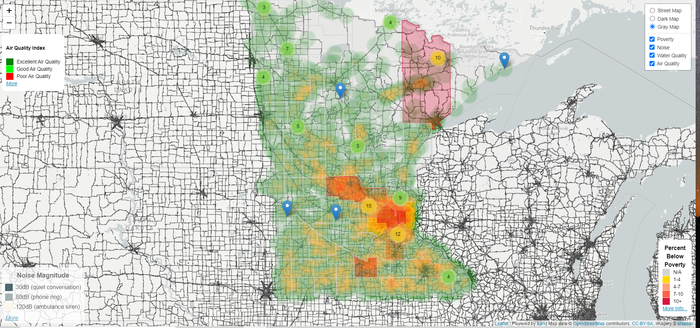

# Poverty and Enviroment
> An interactive map of Minnesota that displays environmental factors that acutely affect the people living there. 

## Sources

* **Poverty Statistics:** [U.S. Census Bureau's 2018 American Community Survey](https://www.census.gov/data/developers/data-sets/acs-1year.html)
* **Air Quality:** [Air Quality Index from Breeze-o-meter](https://breezometer.com/)
* **Drinking Water Quality:** [EPA Envirofacts](https://www.epa.gov/enviro/sdwis-model)
* **Noise Levels:** [Bureau of Transportion Statistics](https://data-usdot.opendata.arcgis.com/datasets/conus-road-and-aviation-noise-image-service)

### Additional Reading

[Drinking Water Contaminants Regulations (pdf)](https://www.epa.gov/sites/production/files/2016-06/documents/npwdr_complete_table.pdf) 
[Noise Wiki (pdf)](https://www.epa.gov/sites/production/files/2016-06/documents/npwdr_complete_table.pdf) 
[How the U.S. Census Bureau Measures Poverty](https://www.census.gov/topics/income-poverty/poverty/guidance/poverty-measures.html)

## Built With
* Mapping: [Leaflet](https://leafletjs.com/)
* Heatmap: [Leaflet.heatmap](https://leafletjs.com/)
* Geocoding: [Travel Time](https://traveltime.com/)
* Markers: [Leaflet.markercluster](https://github.com/Leaflet/Leaflet.markercluster)
* Colors in Legend: [Color Palette Generator](https://github.com/google/palette.js#readme)
* Choropleth Map: [Interactive Choropleth Map](https://leafletjs.com/examples/choropleth/)
